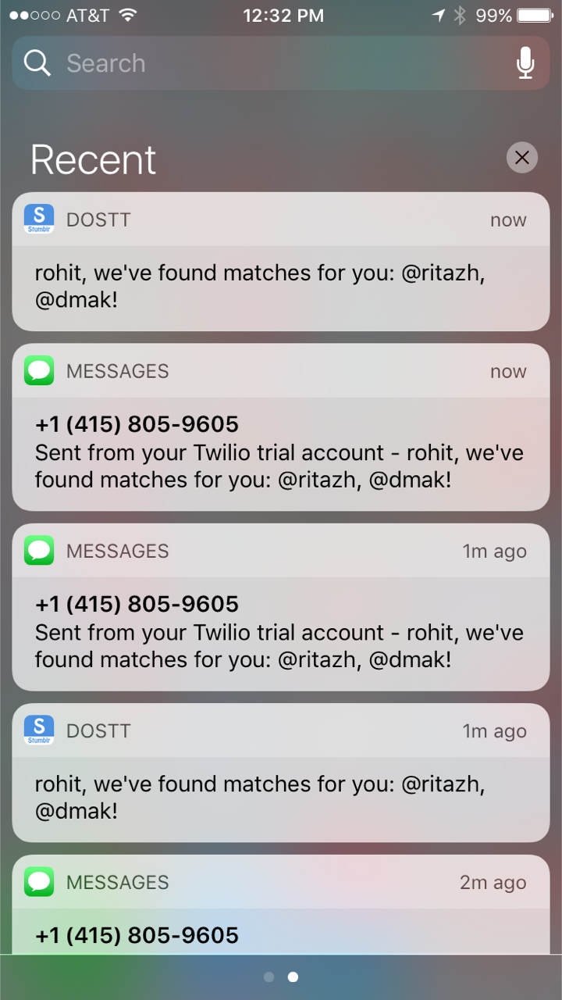

# PeopleFinder with Azure Function

_An application that allows people to find other people with common interests using Azure Functions_.

This is an Azure Function application with 2 functions:
* `addusertoqueue` is a function that periodically adds users who want to find other people with similar interests to a queue for further processing
* `peoplefinder` is a function that gets triggered as new items are added to a queue, in this case an Azure Storage Queue. The function then calls Parse push API to send both an APNS notification and Twilio SMS to the user dequeued from our queue.

 

## Installation

- Setup CI on [Azure Function portal](https://functions.azure.com/signin) to point to this repo:
	- `https://github.com/ritazh/peoplefinder-azurefunction.git`
- Fill in the required values for the following app settings:
	- `APP_ID` - Parse app id for pushing parse notifications to user's device
	- `MASTER_KEY` - Parse app master key for accessing the API calls
	- `TWILIO_FROM` - Twilio from phone number (make sure it has the leading country code, for example, USA numbers lead with 1)
	- `TWILIO_ID` - Twilio app id
	- `TWILIO_KEY` - Twilio app key
	- `DBCONNECT` - Database connection to the Parse database
	- `PARSEPUSHURL` - URL to Parse server REST API
	- `dosttpeoplefinder_STORAGE` - Connecting string to the Azure Storage account hosting the Azure queue

## Acknowledgement
Many thanks to [@dmakogon](@dmakogon) for designing and [developing the mongo queries](https://github.com/dmakogon/peoplematcher) for this application.

## License
Licensed using the MIT License (MIT); Copyright (c) Microsoft Corporation. For more information, please see [LICENSE](LICENSE).
